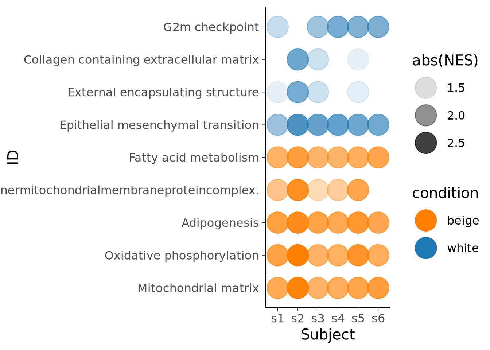
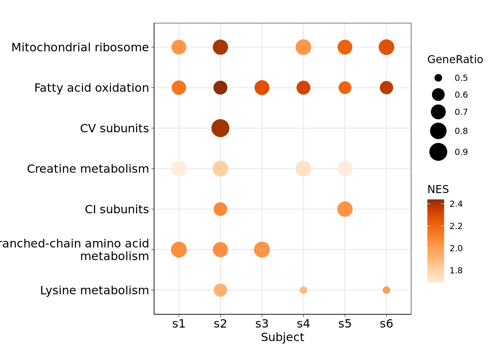

# Variation in beige and white adipose progenitors

# References
- data/other_papers/Human.MitoCarta3.0.csv
- data/gene_sets/msigdb.v2024.1.Hs.symbols.gmt

# ggplot themes
theme_classic(base_size=15) + 
  theme(axis.line = element_line(linewidth = 0.25),
        axis.ticks = element_line(linewidth=0.25)))

# Colour schemes

## white vs beige
### primary: 
- colorRamp2(c(-2,0,2),c("#1F78B4","beige", "#FF7F00"))
- cyan: dichromat::colorschemes$BluetoDarkOrange.12
### discrete:
- cyan: dichromat::colorschemes$BluetoDarkOrange.12[c(10,2)]

### beige continuous:
scale_colour_distiller(palette="Oranges", direction=1)

## Subject colours
pal = c("#DA1819", "#00AED1", "#434D51","#EBB400","#691A93","#3AAD00")

## Timecourse
### White only
Day0 to day3
- pal = c("#B3B3B3","#85C2EA","#1F78B4")
- extra replicate :   "#B2DF8A"
 
### White to beige 

Day 3 white ->  day 0 -> day3 beige 

-  pal = c("#1F78B4", "#85C2EA","#B3B3B3", "#F18486","#E31A1C")
- extra replicate "#FDBF6F"

## Clusters

### Progenitor clusters (p0-7)
- prog_cols = c("#DA1819","#691A93","#EBB400" , "#434D51","#00AED1","#3AAD00","#FF7F00","#AC8AD0")
- TBC!

### unintegrated progenitor clusters (u0+)

- uclusters =  ggsci::pal_simpsons()(12)[c(1:7,9:12)]

### Beige versus white clusters b0-12 & t0-12
- bclusters = tvthemes::gravityFalls_pal()(13)

# Figure Index

## Figure 1

## Figure 4

## Figure 6

# Analysis workflows

**Differentiated adipocytes:**

bulk RNA-seq (Figure 1)

a. [GO](bulk_day15_GO.html)
b. [DGE between subjects](bulk_day15_beige_DGE_between_subjects.html)
c. [UCP1 expression](bulk_day15_UCP1_expr.html)
d. [MitoPathways](bulk_day15_mitopathways.html)

**Adipocyte progenitor analysis:**

day 0 scRNA-seq (Figure 2 & 3)

1. [Initial QC and analysis (2)](progenitors_initial_seurat_analysis.html)
2. [GO terms (2e)](progenitors_initial_marker_gene_ontologies.html)
3. [Integration trial (S2a)](progenitors_integration_trial.html): Test 3 integration methods (RPCA, Harmony and FastMNN) and save the resulting latent representations and UMAP/TSNE diensionality reductions. 
4. [check other cluster numbers (RPCA; S2b)](progenitors/progenitors_rpca_clustree.html)
5. [RPCA integration (3)](progenitors_rpca_integrations.html) 
6. [RPCA clusters and markers (3b)](progenitors_rpca_clusters_and_markers.html)*
7. [RPCA cell cycle (Supp 3)](progenitors_rpca_cell_cycle.html)* <- check cluster ids

Other tests

* [sctranform test](progenitors_sctransform_test.html)
* [try regressing out UMI count; no effect](progenitors/initial_seurat_analysis_regress_out.html)
* [RPCA published annotation](progenitors_rpca_published_annotation.html)*
* [RPCA Emont annotation](progenitors_rpca_azimuth_emont_annotation.html)

**Early adipogenesis**

scRNA-seq 
day 0, 1 and 3 of differentiation
Figure 4

1. [White adipogenesis](white_only_downsample.html)
2. [Go terms](white_only_downsample_markers.html)
3. [Composition?]()

**Beige vs White **

scRNA-seq,
day 0, 1 and 3 of differentiation with vs without rosiglitazone 

Gene level (Figure 5B & C)

1. [Initial Analysis (Supp 5 A,B)](beige_vs_white_downsample.html)
2. [GO terms (Supp 5C,D)](beige_vs_white_downsample_markers_and_go.html)
3. [Beige vs white DE per time (Supp 5F)](beige_vs_white_downsample_DE_per_time.html)
4. [Cluster composition test (5B)](beige_vs_white_downsample_cluster_tests.html)
5. [Beige vs white DE per cluster (5C)](beige_vs_white_downsample_DE_per_cluster.html)

TSS-level (Figure 5D-I)

1. [Initial analysis (5D)](tss_bvw_initial.html)
2. [Cluster composition test (5E)](tss_bvw_initial_cluster_tests.html)
3. [GO terms (5F,G)](tss_bvw_initial_markers_and_go.html)
4. [DE per time (Supp 7D)](tss_bvw_initial_DE_per_time.html)
5. [DE per cluster (5H,I)](tss_bvw_initial_DE_per_cluster.html)

**Trajectory analysis **

TSS-level trajectory analysis
Figure 6 A-C

1. [Integration trial (Supp 8)](tss_integration_trial.html)
2. [FastMNN analysis](tss_bvw_fastmnn.html)
3. [Monocle analysis on fastmnn (6A)](tss_bvw_fastmnn_monocle_umap.html)
4. [Monocle + progenitor cells (6B-C)](tss_bvw_fastmnn_monocle_umap_plots.html)

Gene-level trajectory analysis
Figure 6 D-H

1. [Integration trial (6D & Supp S9A-C)](white_only_integration_trial.html)
2.[RNA velocity analysis on fastmnn (6E,F)](white_only_fastmnn_velociraptor_dynamical.html)
3. [RNA velocity plots (6F)](white_only_fastmnn_velociraptor_dynamical_plots.html)
4. [Monocle analysis on fastmnn (6F)](white_only_fastmnn_monocle_tsne.html)
5. [Progenitor markers (6G,H)](white_only_fastmnn_progenitor_trajectory_markers.html)

